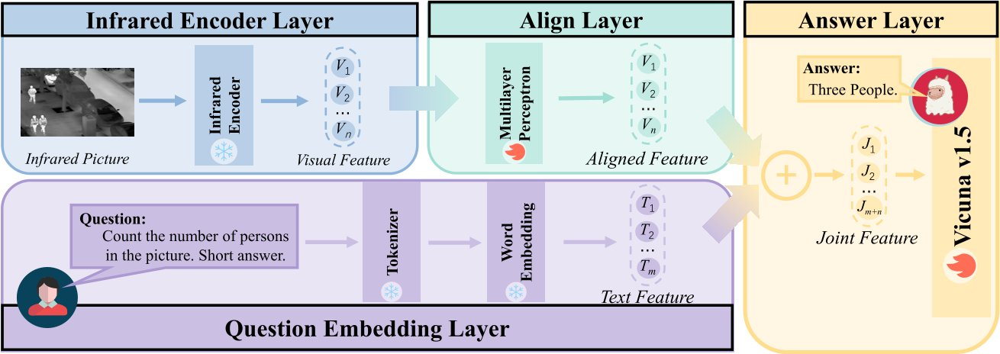

<h2>
Infrared-LLaVA: Enhancing Understanding of Infrared Images in Multi-Modal Large Language Models
</h2>

<b>Shixin Jiang</b>1∗,
<b>Zerui Chen</b>1,
<b>Jiafeng Liang</b>1,
<b>Yanyan Zhao</b>1,
<b>Ming Liu</b>1,2†,
<b>Bing Qin</b>1,2

1Harbin Institute of Technology, Harbin, China

2Peng Cheng Laboratory, Shenzhen, China

    <!--  -->
    
    
    
    <!--  -->

This repository contains the resources for **EMNLP2024** paper **_Infrared-LLaVA: Enhancing Understanding of Infrared Images in Multi-Modal Large Language Models_**

For more details, please refer to the paper: [Infrared-LLaVA: Enhancing Understanding of Infrared Images in Multi-Modal Large Language Models](https://aclanthology.org/2024.findings-emnlp.501.pdf).

## 🎉 Updates

- 2025/04/19 We have updated our dataset.
- 2024/09/22 Our paper is accepted by EMNLP2024 Finding.

##  Dataset
- [Infrared-Images](https://huggingface.co/datasets/ThreeGold11602/syentic_images)
- [Infrared-Pretrain-500k](https://huggingface.co/datasets/ThreeGold11602/infrared-pretrain-500k)
- [Infrared-Instruct-12k](https://huggingface.co/datasets/ThreeGold11602/infrared-instruct-12k)